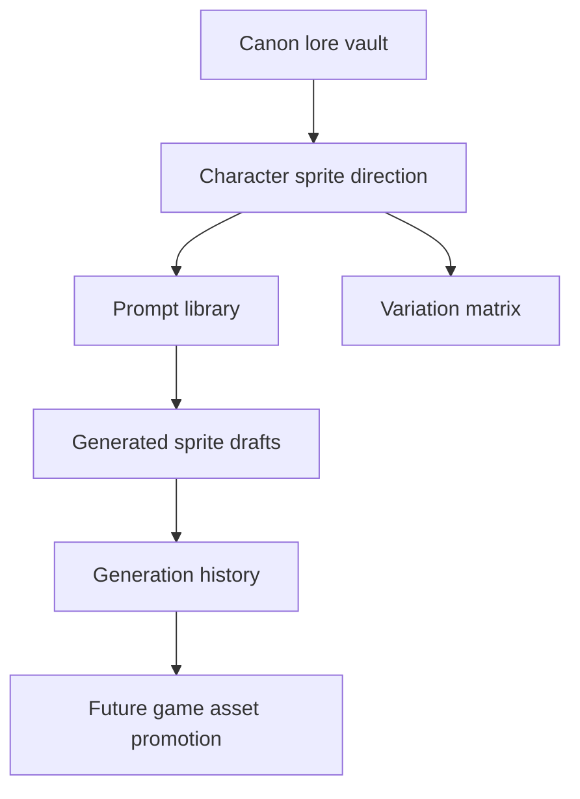

# 2026-06-03

## Session 1 - Character Sprite Direction Setup

### System Flow

### Affected Components

- Lore: shared canon/art direction.
- Scourge Survivors game identity and folder naming.
- Scourge Survivors assets: unreferenced sprite draft folder only.
- Runtime behavior: unchanged, except project/menu/storage naming.

### What Was Done

- Read lore files for universe, factions, games, location, and Scourge bestiary.
- Read `scourge-survivors` sprite wiring, player avatar ids, enemy sprite usage, and asset dimensions.
- Added lore-side sprite direction, prompt library, variation matrix, and generation ledger.
- Linked the new art direction files from `lore/00-Index.md` and `lore/Universe/Style-Bible.md`.
- Generated one Pyre Ranger front-view probe and saved it as a draft, not as a runtime replacement.
- Renamed the game folder from `fpsdemo` to `scourge-survivors`.
- Replaced legacy `fpsdemo` / `FPS ARENA` project-facing references with Scourge Survivors naming.
- Updated sprite prompt direction to follow `lore/DESIGN.md`: DOOM-like blood, rust, gunmetal,
  bone, hellfire, toxic green for Scourge only, no neon.
- Added first-roster lore stubs for Pyre avatars, Warden defenders, Pactfall heroes, Starblight
  pilots, and the first Scourge creature/craft set.
- Added reusable skills for sprite iteration:
  `sprite-concept-batches` and `sprite-asset-promotion`.

### Key Decisions

- Do not replace FPS sprites until the faction direction and prompt batches are reviewed.
- Treat current "all characters" as current code roster plus lore-implied faction roles: Pyre player avatars, Scourge enemies, Warden concepts, Pactfall concepts, and Starblight concepts.
- Keep Warden, Pactfall, and Starblight roles as prompt-ready placeholders, not locked canon.
- Use Pyre variation lanes: Tactical, Zealot, Perdition.
- Use Scourge as bio-industrial parasite as an interim direction until the lore chooses demonic, alien, machine, or fungal.
- The active design source is `lore/DESIGN.md`; it supersedes the earlier neon-industrial language.
- Current production bridge: generate sprites against character/bestiary stubs first, then promote
  selected assets into game folders and manifests.
- Split the asset workflow into two side-effect boundaries: concept batches create drafts and ledgers;
  promotion replaces runtime assets only after approval.

### Files Changed

- `lore/Art/Character-Sprite-Direction.md`
- `lore/Art/Character-Prompt-Library.md`
- `lore/Art/Variation-Matrix.md`
- `lore/Art/Generation-History.md`
- `lore/00-Index.md`
- `lore/Bestiary/Scourge.md`
- `lore/Games/Pactfall.md`
- `lore/Games/Starblight.md`
- `lore/Universe/Survivors-Loop.md`
- `lore/Characters/Ranger.md`
- `lore/Characters/Bulwark.md`
- `lore/Characters/Vector.md`
- `lore/Characters/Patch.md`
- `lore/Characters/Field-Engineer.md`
- `lore/Characters/Lane-Gunner.md`
- `lore/Characters/Wallwright.md`
- `lore/Characters/Pyre-Duelist.md`
- `lore/Characters/Pyre-Cauterizer.md`
- `lore/Characters/Warden-Bastion.md`
- `lore/Characters/Warden-Artillerist.md`
- `lore/Characters/Pyre-Interceptor-Pilot.md`
- `lore/Characters/Warden-Defense-Pilot.md`
- `lore/Bestiary/Swarm-Ripper.md`
- `lore/Bestiary/Swarm-Spitter.md`
- `lore/Bestiary/Breach-Boss.md`
- `lore/Bestiary/Trucebreaker.md`
- `lore/Bestiary/Scourge-Fighter.md`
- `lore/Bestiary/Orbital-Breach-Carrier.md`
- `lore/Games/Scourge-Survivors.md`
- `lore/Universe/Premise.md`
- `lore/Universe/Style-Bible.md`
- `scourge-survivors/.env.example`
- `scourge-survivors/DEPLOY.md`
- `scourge-survivors/README.md`
- `scourge-survivors/package.json`
- `scourge-survivors/package-lock.json`
- `scourge-survivors/partykit.json`
- `scourge-survivors/src/components/HUD.tsx`
- `scourge-survivors/src/game/storage.ts`
- `scourge-survivors/src/assets/sprites/drafts/README.md`
- `scourge-survivors/src/assets/sprites/drafts/player-ranger-front-pyre-v01-source.png`
- `scourge-survivors/src/assets/sprites/drafts/player-ranger-front-pyre-v01-cutout.png`
- `skills/*` references to the canonical game folder were updated from `fpsdemo` to `scourge-survivors`.
- `skills/skills/sprite-concept-batches/SKILL.md`
- `skills/skills/sprite-concept-batches/agents/openai.yaml`
- `skills/skills/sprite-concept-batches/references/first-roster.md`
- `skills/skills/sprite-concept-batches/references/ledger-template.md`
- `skills/skills/sprite-asset-promotion/SKILL.md`
- `skills/skills/sprite-asset-promotion/agents/openai.yaml`
- `skills/skills/sprite-asset-promotion/references/promotion-checklist.md`
- `skills/skills/sprite-asset-promotion/scripts/chroma_cutout.sh`
- `skills/README.md`
- `skills/.agents/memory/MEMORY.md`

### Mistakes And Fixes

- Tried the bundled chroma-key helper with `python`; this environment only has `python3`.
- The helper also required Pillow, which was unavailable. Used `ffmpeg chromakey` to create a draft alpha cutout and recorded that limitation in the generation ledger.
- Initial validation failed because `node_modules` was missing after the folder rename. Ran `npm install`
  from the existing lockfile, then `npm run typecheck` and `npm run build` both passed.
- `npm install` reported 5 audit findings; dependency versions were not changed in this rename pass.
- New sprite skills passed `quick_validate.py`.
- `sprite-asset-promotion/scripts/chroma_cutout.sh` was smoke-tested against the Ranger source draft
  and produced an alpha PNG.

### Next Steps

- Review the art direction with Vincent before generating more assets.
- Generate front-view Pyre variants for Ranger, Bulwark, Vector, and Patch.
- Pick one direction, then generate side/back views.
- Repeat the process for Scourge enemies, then Warden, Pactfall, and Starblight concepts.

## Update: Games Workspace Layout + Scourge Parasite Rule

### What Changed

- Moved the active game repo from workspace root into `games/scourge-survivors`.
- Added `games/README.md` to define `games/<slug>` as the default local layout for all games.
- Updated the Electron studio launcher to resolve game repos through `games/<slug>`.
- Updated `@shipshit/assetgen` so omitted `--repo` values prefer `./games/<game>` or
  `../games/<game>`.
- Updated studio catalogue naming to keep `pactfall` and add `starblight`.
- Normalized skill/lore local path references from `scourge-survivors/...` to
  `games/scourge-survivors/...` where they refer to files.
- Tightened Scourge art direction: Scourge assets must read as parasites wearing,
  consuming, or rewriting a host/medium, not generic standalone monsters.
- Added the parasite rule to `lore/DESIGN.md`, `Character-Sprite-Direction.md`,
  `Character-Prompt-Library.md`, `Variation-Matrix.md`, and the sprite-generation skills.
- Updated `assetgen` prompt suffixing so prompts mentioning Scourge automatically include
  the parasite/host-takeover rule.

### Verification

- `npm run typecheck` passed in `games/scourge-survivors`.
- `npm run build` passed in `games/scourge-survivors`.
- `bun run typecheck` passed in `shipshitgames`; Turbo still reports the pre-existing package
  graph warning from the workspace lockfile.
- `node --check apps/desktop/electron/main.cjs` passed.
- Both sprite skills passed `quick_validate.py`.
- `git diff --check` passed for `shipshitgames`, `skills`, `lore`, and `games/scourge-survivors`.
- Mock `assetgen` probe confirmed default `games/scourge-survivors` lookup and the Scourge
  parasite prompt suffix.

### Next Step

- Re-review the existing Scourge concept drafts against the new parasite rule before any
  promotion or regeneration.

## Update: Studio Repo Rename + Scourge Host Families

### What Changed

- Renamed the local studio repo folder from `monorepo` to `shipshitgames`.
- Confirmed the GitHub repository is already `shipshitgames/shipshitgames` with remote
  `https://github.com/shipshitgames/shipshitgames.git`.
- Replaced remaining local `monorepo` naming in active docs/code with studio-repo wording.
- Added `lore/Bestiary/Scourge-Host-Families.md`.
- Codified the Scourge as one parasite army wearing many conquered host races, not one
  repeated monster type.
- Defined the default Scourge grammar: toxic-green nodes, black chitin, wet tissue,
  tendrils, rupture seams, and host material being consumed.
- Added first host families: Rot-Infested Flesh, Chitin Warhost, Mycelial Spore,
  Machine-Graft, Bone Titan, and Voidship.
- Updated art direction, prompt library, variation matrix, sprite concept skill, and
  `assetgen` prompt suffixing to require host-family selection for Scourge batches.

### Verification

- `git diff --check` passed for `lore`, `skills`, and `shipshitgames`.
- Both sprite skills passed `quick_validate.py`.
- `bun run typecheck` passed in `shipshitgames`; Turbo still reports the existing workspace
  graph warning.
- Mock `assetgen` probe confirmed the automatic Scourge suffix now says one parasite army
  wearing conquered host races with flesh/chitin/fungal/machine-graft/bone titan/voidship
  host variety.

### Next Step

- Regenerate Scourge concepts by threat role plus host family, starting with Ripper flesh
  and chitin variants, Spitter mycelial and machine-graft variants, and Breach-Boss bone
  titan and machine-graft variants.
