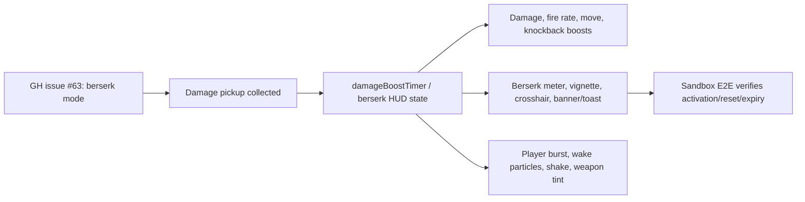

# 2026-06-06

## Session 1 - Scourge Survivors Berserk Visual Pass

### System Flow

### Affected Components

- Frontend/HUD: `apps/games/scourge-survivors/src/components/HUD.tsx`, `src/styles.css`
- Gameplay systems: `constants.ts`, `types.ts`, `HudSystem.ts`, `PickupsSystem.ts`, `PlayerSystem.ts`, `WeaponSystem.ts`, `FxSystem.ts`
- Audio: `AudioEngine.ts`
- Verification: `tests/e2e/sandbox.spec.ts`
- External reference: `https://github.com/shipshitgames/scourge-survivors/issues/63`

### What Was Done

- Turned the damage pickup into an explicit berserk state while keeping the existing internal timer compatibility.
- Added berserk duration/progress to HUD state.
- Added berserk stat effects: 2x damage, faster fire/melee cadence, movement boost, and stronger knockback.
- Added screen/weapon/UI/audio clues: BERSERK banner/toast, persistent meter with bar, red flicker vignette, slash pulses, crosshair pulse, weapon tint/jitter, muzzle flash shift, player burst/wake particles, shake, hitstop, and a dedicated synth cue.
- Made floating damage numbers much larger, blood-red, splattered, and visually distinct for normal/crit/headshot hits.
- Added a sandbox E2E test for berserk activation, repeated activation reset, and expiration.

### Key Decisions

- Reused `damageBoostTimer` as the authoritative timer to avoid widening reset/startup behavior, and exposed `berserk`/`berserkFrac` as the reader-facing HUD contract.
- Kept repeated pickups as a timer reset instead of stacking modifiers, matching the issue requirement that modifiers reset cleanly.
- Used runtime Three.js/CSS effects rather than new assets so the change stays scoped to gameplay and HUD code.

### Verification

- `cd apps/games/scourge-survivors && bun run typecheck`
- `cd apps/games/scourge-survivors && bun run test:unit`
- `cd apps/games/scourge-survivors && bun run test:e2e`
- `cd apps/games/scourge-survivors && bun run build`
- In-app browser opened `http://127.0.0.1:5178/?sandbox=1`; sandbox rendered cleanly with no page errors. Active berserk state was verified by Playwright E2E because the browser runtime could not access dev globals and keypress collection was unreliable.

### Mistakes and Fixes

- Initial typecheck failed before `bun install` due unresolved workspace dependencies; `bun install` completed with no lockfile changes and typecheck then passed.
- First E2E assertion expected `berserkFrac` to be exactly `1`; fixed to allow normal timer drift.
- First E2E text locator matched both toast and meter; fixed by scoping to `.scourge-berserk-meter`.

### Next Steps

- Playtest real pickup collection feel in a normal run and tune intensity if the overlay becomes too obstructive during dense waves.
