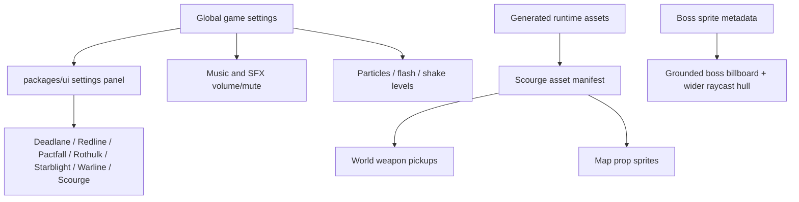

# 2026-06-07 Sessions

## Session 1 - Global Settings, Scourge Asset Fixes, And Runtime Polish

### System Flow

### Affected Components

- `packages/ui`: shared global game settings state, sliders, music toggle, and styling.
- `apps/games/*`: wired shipped games to global music/sound/VFX settings and title-screen music toggles.
- `apps/games/scourge-survivors`: audio/VFX channels, boss billboard grounding/hitboxes, pickup sprite rendering, sandbox asset previews.
- `packages/assets/games/scourge-survivors`: generated map prop sprites and generated weapon pickup sprites, manifest and credits updates.
- `.agents/memory`: pending rule captured for generated runtime art quality/provenance.

### What Was Done

- Added global persisted game settings for per-effect levels: music, sound, particles, flash, and shake, plus a music mute flag.
- Added shared settings UI controls and connected title/main screen music toggles across shipped games.
- Updated Scourge Survivors audio/VFX systems to respect per-channel settings.
- Fixed Scourge boss presentation by grounding boss sprites, disabling boss bob, and widening boss raycast/collision helper sizing to match new art.
- Split first-person weapon sprites from world pickup sprites so floor pickups do not show hands.
- Replaced procedural placeholder pickup assets with generated bitmap Pyre pickup sprites for pistol, SMG, shotgun, cannon, and sniper.
- Replaced procedural-looking map prop placeholders with generated bitmap world props for Ashgate, the Hollow Lanes, the Maw, and Perdition.
- Verified key Scourge flows in the in-app browser sandbox, including map prop rendering and weapon pickup spawning.

### Key Decisions

- World pickups must use separate art from first-person weapon sprites.
- Generated runtime art should use image generation, not SVG/procedural placeholder substitutes, unless explicitly requested.
- Asset provenance must be honest: do not claim a model/tool path that was not actually used.
- Boss sprite physics and hitbox behavior should follow runtime art scale, not stale humanoid proxy assumptions.

### Files Changed

- Global settings: `packages/ui/src/settings.ts`, `packages/ui/src/GameSettings.tsx`, `packages/ui/src/index.ts`, `packages/ui/src/styles.css`.
- Game integrations: app shell/game/render/audio files across `apps/games/deadlane`, `pactfall`, `redline`, `rothulk`, `starblight`, `warline`, and `scourge-survivors`.
- Scourge systems: `Enemy.ts`, `PickupsSystem.ts`, `FxSystem.ts`, `AudioEngine.ts`, `spriteAssets.ts`, sandbox/HUD/storage/context files.
- Assets: `packages/assets/games/scourge-survivors/assets.json`, `CREDITS.md`, map prop WebPs, and weapon pickup WebPs.
- Rules: `.agents/memory/captured-rules.md`.

### Mistakes And Fixes

- Initially used procedural/SVG pickup placeholder assets. Fixed by replacing them with generated bitmap sprites and updating provenance.
- Temporarily mislabeled map prop provenance and treated `OPENAI_API_KEY` as required for Codex image generation. Fixed metadata and captured the correct rule.
- First pass on boss sprite placement left it visually floating and with stale hitbox assumptions. Fixed sprite offsets, bobbing, radius, and raycast helper boxes.

### Verification

- `cd apps/games/scourge-survivors && bun run typecheck`
- `cd apps/games/scourge-survivors && bun run build`
- `node -e "JSON.parse(require('fs').readFileSync('packages/assets/games/scourge-survivors/assets.json','utf8')); console.log('assets.json ok')"`
- Browser sandbox checks at `http://127.0.0.1:5182/?sandbox=1` for boss grounding, map prop rendering, and weapon pickup spawning.

### Next Steps

- Run root `bun run typecheck` and `bun run build` before committing the full session.
- Promote the captured generated-art rule into permanent project memory if the user confirms.
- Consider a separate pass to replace or stylize the remaining black collision/cover geometry, which is not part of the prop sprite layer.
