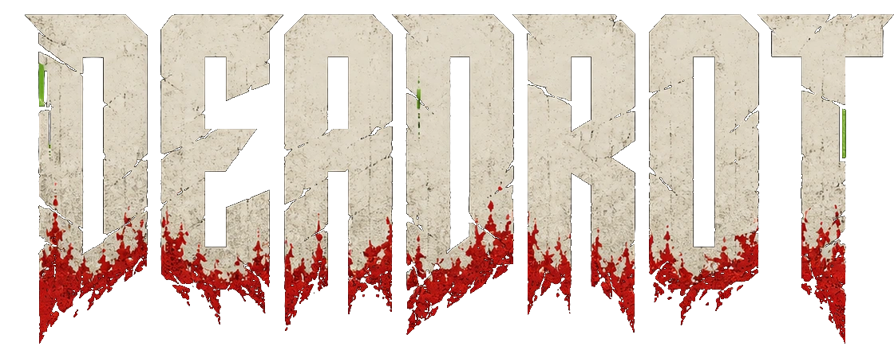

# DEADROT



**The player-facing DEADROT monorepo: hub, lore, games, assets, and runtime
packages.**

[deadrot.com](https://deadrot.com)

> We lost the sky. Now we burn it back.

## Current Stage

DEADROT is the shipped game-universe repo. The Next.js hub is the front door for
the IP, the Quartz lore vault carries canon, and the Vite game apps live together
under `apps/games/*` so they can share assets, UI, engine primitives, and the
Warline operation contract.

Studio tooling for generating assets and operating the build-in-public product
surface lives next door in
[`shipshitgames/shipshitgames`](https://github.com/shipshitgames/shipshitgames).
Generated game assets and runtime packs ship from this repo.

## Apps

- `apps/web` - live Next 16 hub for the universe front, game gallery, factions,
  waitlist, and game loader.
- `apps/lore` - Quartz-based lore and canon vault for the DEADROT universe.
- `apps/games/scourge-survivors` - playable React/Vite/Three.js FPS survivor
  slice with PartyKit support, unit tests, and Playwright E2E.
- `apps/games/warline` - playable War for the Lanes strategy front, backed by
  `@shipshitgames/warline` and optional PartyKit live mode.
- `apps/games/deadlane` - prototype tower-defense lane holder.
- `apps/games/redline` - prototype high-speed Pyre courier runner.
- `apps/games/rothulk` - skeleton side-scroller inside a Scourge bio-ship.
- `apps/games/pactfall` - concept Pyre-vs-Wardens MOBA thin slice.
- `apps/games/starblight` - concept arcade shooter / orbital intercept slice.

## Packages

- `packages/assets` / `@shipshitgames/assets` - canon asset catalog, shared
  runtime assets, Scourge Survivors manifest, and preserved site public assets.
- `packages/engine` / `@shipshitgames/engine` - shared Three.js runtime
  primitives: game/context/systems spine, movement, camera, bounds, spawning,
  HUD shell, and presence hooks.
- `packages/ui` / `@shipshitgames/ui` - shared React game UI primitives and
  DEADROT-flavored styles.
- `packages/warline` / `@shipshitgames/warline` - pure Warline world model,
  reducers, operation contract, and client SDK.

## Repo Map

```txt
apps/
  web/                  # deadrot.com
  lore/                 # Quartz canon vault
  games/
    scourge-survivors/  # primary playable FPS slice
    warline/            # persistent strategy front
    deadlane/
    redline/
    rothulk/
    pactfall/
    starblight/
packages/
  assets/
  engine/
  ui/
  warline/
docs/
scripts/
```

## Develop

```bash
bun install
bun run dev
bun run build
bun run typecheck
bun run ci
```

Useful checks:

```bash
bun run assets:check
bun run e2e:docker
bun run e2e:ui
```

E2E artifacts are written to `.artifacts/e2e/`. See
[`docs/e2e.md`](docs/e2e.md) for local UI mode, report viewing, and CI
expectations.

## Game Deploys

Game apps live on `master` under `apps/games/*`. Vercel game projects should be
deployed from this monorepo with the Vercel CLI, not from old standalone repos.

Deploy only when runtime files for a game or shared runtime package changed:

```bash
bun run deploy:games:changed -- --dry-run
bun run deploy:games:changed
```

The deploy script checks changed files under `apps/games/<slug>/` plus shared
runtime packages. Docs-only edits do not trigger a game deploy.
