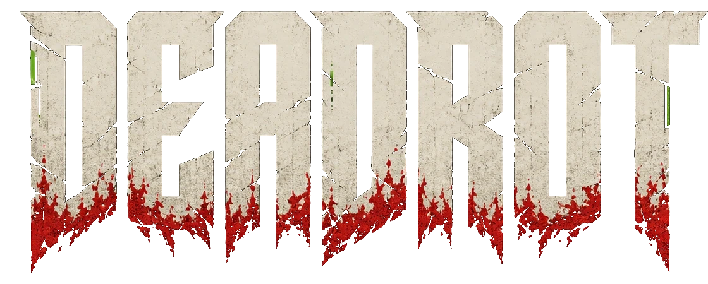

# DEADROT



**The player-facing DEADROT monorepo: hub, lore, games, assets, and runtime
packages.**

[deadrot.com](https://deadrot.com)

> We lost the sky. Now we burn it back.

## Current Stage

DEADROT is the shipped game-universe repo. The Next.js hub is the front door for
the IP, the Quartz lore vault carries canon, the Bun API supports player-facing
services, and the Vite game apps live together under `apps/games/*`. Seven
playable fronts report into Warline, the shared operation front.

Studio tooling for generating assets and operating the build-in-public product
surface lives next door in
[`shipshitgames/shipshitgames`](https://github.com/shipshitgames/shipshitgames).
Generated game assets and runtime packs ship from this repo.

## Apps

- `apps/web` - live Next 16 hub for the universe front, game gallery, factions,
  waitlist, and game loader.
- `apps/api` - Bun/Postgres API for player-facing Deadrot services.
- `apps/lore` - Quartz-based lore and canon vault for the DEADROT universe.
- `apps/games/scourge-survivors` - playable React/Vite/Three.js FPS survivor
  slice with PartyKit support, unit tests, and Playwright E2E.
- `apps/games/{scourge-survivors,deadlane,pactfall,brawl,starblight,redline,rothulk}` -
  the seven playable front games.
- `apps/games/warline` - the persistent War for the Lanes operation front,
  backed by `@shipshitgames/warline` and optional PartyKit live mode.

## Packages

- `packages/assets` / `@shipshitgames/assets` - canon asset catalog, shared
  runtime assets, Scourge Survivors manifest, and preserved site public assets.
- `packages/catalog` / `@deadrot/catalog` - the single source of truth for the
  game roster, routes, ports, and deployment records.
- `packages/game-kit` / `@deadrot/game-kit` - shared Deadrot runtime utilities,
  audio, juice/VFX, codex mapping, and cross-game war records.
- `packages/ui` / `@shipshitgames/ui` - shared React game UI primitives and
  DEADROT-flavored styles.
- `packages/warline` / `@shipshitgames/warline` - pure Warline world model,
  reducers, operation contract, and client SDK.

`@shipshitgames/engine` is consumed from its published org-level package; there
is no `packages/engine` in this repository. The studio generator package
`packages/assetgen` belongs to the sibling `../shipshitgames` repository.

## Repo Map

```txt
apps/
  api/                  # player-facing Bun API
  web/                  # deadrot.com
  lore/                 # Quartz canon vault
  games/
    {scourge-survivors,deadlane,pactfall,brawl,starblight,redline,rothulk}/
                         # seven playable fronts
    warline/            # persistent operation front
packages/
  assets/
  catalog/
  game-kit/
  ui/
  warline/
docs/
scripts/
```

The generated [repository catalog](docs/repository-catalog.generated.md) is the
current workspace map and game roster; update it with `bun run docs:catalog`.

## Develop

```bash
bun install
bun run dev
bun run build
bun run typecheck
bun run ci
```

Useful checks:

```bash
bun run assets:check
bun run test:coverage   # line+function coverage gate (catalog, game-kit, warline)
bun run e2e        # cross-game Playwright suite
bun run e2e:docker
bun run e2e:ui
```

E2E artifacts are written to `.artifacts/e2e/`. See
[`docs/e2e.md`](docs/e2e.md) for local UI mode, report viewing, and CI
expectations. The coverage baseline (enforced scope, exclusions, and how to add
a package) is documented in [`docs/coverage.md`](docs/coverage.md).

## Game Deploys

Game apps live on `master` under `apps/games/*`. Vercel game projects should be
deployed from this monorepo with the Vercel CLI, not from old standalone repos.

Deploy only when runtime files for a game or shared runtime package changed:

```bash
bun run deploy:games:changed -- --dry-run
bun run deploy:games:changed
```

The deploy script checks changed files under `apps/games/<slug>/` plus shared
runtime packages. Docs-only edits do not trigger a game deploy.
