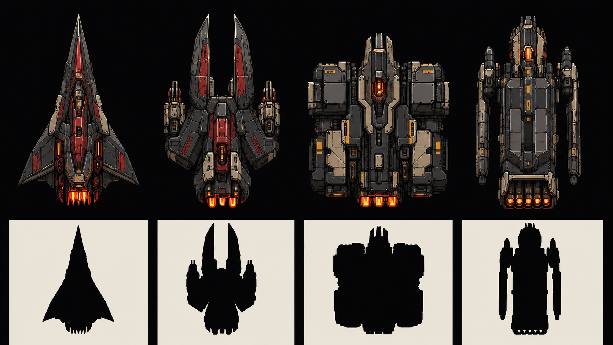
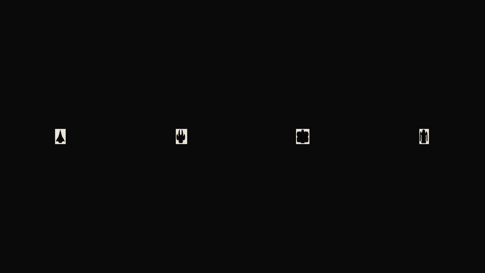

# Starblight Design

This file applies the shared [Deadrot design contract](../../lore/content/DESIGN.md)
and [Style Bible](../../lore/content/Universe/Style-Bible.md) to Starblight's
top-down arcade camera. It is the game-local authority for player hull shape,
materials, glow, and production. Canon remains in
[Games/Starblight](../../lore/content/Games/Starblight.md). The annotated
reference board, touchstones, and adopt/reject review live in the
[Starblight Reference Moodboard v01](../../lore/content/Art/Starblight-Reference-Moodboard-v01.md).

## Ship & Hull Language

### Camera and readability lock

- Read every player hull in strict orthographic top-down view. The nose points
  along travel; banking may compress the plane but must not replace the outline.
- The current player plane is `2.6` world units tall in a `48` world-unit-high
  view. A hull therefore occupies `5.4167%` of viewport height: about `58 px` on
  a 1080 px canvas and `39 px` on a 720 px canvas.
- Judge the outer contour before panel detail. At gameplay scale, the player
  must remain identifiable as one of the four bodies below when filled solid
  black and surrounded by Scourge shapes.
- Keep the nose, shoulders, waist, and engine termination clear. Antennae,
  barrels, and surface decals never carry the body identity by themselves.

### Shared construction grammar

Human hulls are repaired war machines, not clean aerospace products. Use a
coal/gunmetal structural core, bone heat shields and repair plates, hard black
contours, flat shadow groups, and restrained wear. Large value blocks must
survive reduction; small panel seams are secondary.

Proportion bodies by four silhouette landmarks:

1. **Nose** — one decisive leading shape; never a round saucer.
2. **Shoulders** — the widest faction-defining mass.
3. **Waist** — negative space that separates wings, armor, or outriggers.
4. **Engine termination** — compact hot hardware, distinct from the body mass.

### Starter hull bodies

| Body | Faction | Pure-silhouette read | Material and glow read | Future play identity |
| --- | --- | --- | --- | --- |
| `pyre-razor` | Pyre | Long spearhead triangle, clipped swept wings, narrow waist | Blood panels and a compact hellfire furnace at the tail | Nimble interceptor |
| `pyre-furnace` | Pyre | Split-prong nose, forward weapon shoulders, short heavy tail | Scorched gunmetal, blood shoulder plates, clustered hellfire exhaust | Aggressive gunship |
| `warden-bastion` | Wardens | Broad square shoulders, central shield spine, planted block mass | Bone armor blocks, sparse hazard yellow, ember hardware | Defensive bulwark |
| `warden-shepherd` | Wardens | Long rectangular carrier body, separated protective outriggers | Gunmetal slab body, bone repair plates, hazard-yellow marks, ember launch bay | Escort/carrier frame |

Pyre is triangular, forward-loaded, cut away at the waist, and visibly burner
driven. Warden is square, planted, buttressed, and built around protected volume.
Do not trade these reads between factions merely to vary a skin.

### Player glow language

Player emission is mechanical and local: hard-edged blood-hot/hellfire furnace
rims on Pyre; small hazard-yellow/ember status blocks and exhaust apertures on
Wardens. It does not bloom across the hull or outline the entire ship.

`#8bdc1f` toxic green and its hot variant are forbidden on every human hull,
cockpit, engine, shield, pickup indicator, and player trail. Toxic light means
Scourge infection; preserving that monopoly is a combat-readability rule.

### Locked reference sheet

The upper row is the material/faction reference. The lower row is the required
pure-black test. The companion plate below places the same four black reads at
approximately `58 px` ship height on a 1920×1080 viewport: the real scale from
`2.6 / 48 × 1080`. The sheet is a design master, not a runtime sprite atlas.

## Asset-production decision

M0 locks silhouettes without replacing the current `player-interceptor.webp`.
Production should proceed in two stages:

1. Prototype each body as an imperative Three.js composite built from a small
   shared vocabulary of flat planes/prisms. This keeps silhouette and handling
   iteration cheap and matches Starblight's current imperative frame loop.
2. Once body mechanics are approved, author clean comic-ink top-down sprite or
   low-poly masters from the locked composites. Promote only reviewed runtime
   WebP files through `@shipshitgames/assets`; do not import from game-local
   raster folders.

Every promoted body must receive a stable kebab-case ID matching the table,
an `assets.json` sprite record with intrinsic dimensions, anchor, filtering,
license/provenance, and an explicit import in the Starblight sprite registry.
Primitive prototypes must use the same IDs in code so promotion does not change
save data or loadout references. Generated PNGs stay in `sources/generated` and
approved lossless masters stay under `masters`; runtime rasters are WebP only.
