# Character Asset Status

Visual review board for current character, player, and core enemy assets.

Source of truth stays in `packages/assets`. The images below are vault-local preview copies so Obsidian and Quartz can show them inline. When a source asset changes, refresh the matching preview in `Assets/Asset-Status/previews/`.

## Status Key

- **Good**: usable as-is for the current pass.
- **Review**: visible and useful, but still needs visual review or a final generation pass.
- **Missing**: no usable shared asset yet.
- **Locked**: generated/promoted through the current locked medium-chunky pixel style, with prompt/source recorded in [[Style-Lock-Audit-2026-06-05]] or [[Generation-History]].
- **Runtime**: actively consumed by a shipped game or runtime manifest.
- **Catalog preview**: visible package preview for the shared catalog, not necessarily a final in-game camera render.
- **Portrait only**: web/lore plate exists, but no gameplay sprite or shared catalog render exists yet.

## Character Roster

| Lore note                  | Preview                                                                                                                                    | Game/use                     | Good?  | Locked? | Current package source                                                                | Next action                                                     |
| -------------------------- | ------------------------------------------------------------------------------------------------------------------------------------------ | ---------------------------- | ------ | ------- | ------------------------------------------------------------------------------------- | --------------------------------------------------------------- |
| [[Ranger]]                 | 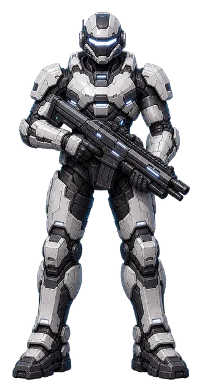                                  | [[Scourge-Survivors]] player | Review | No      | `packages/assets/games/scourge-survivors/players/pyre/ranger/{front,side,back}.webp`  | Regenerate in locked 110px-ish pixel pipeline.                  |
| [[Bulwark]]                | 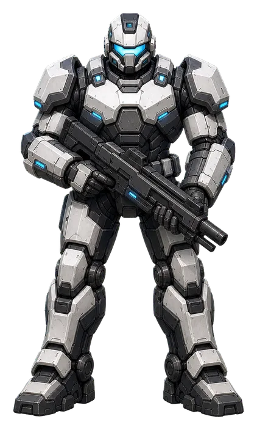                                | [[Scourge-Survivors]] player | Review | No      | `packages/assets/games/scourge-survivors/players/pyre/bulwark/{front,side,back}.webp` | Regenerate in locked 110px-ish pixel pipeline.                  |
| [[Vector]]                 | 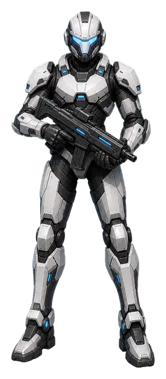                                  | [[Scourge-Survivors]] player | Review | No      | `packages/assets/games/scourge-survivors/players/pyre/vector/{front,side,back}.webp`  | Regenerate in locked 110px-ish pixel pipeline.                  |
| [[Patch]]                  | 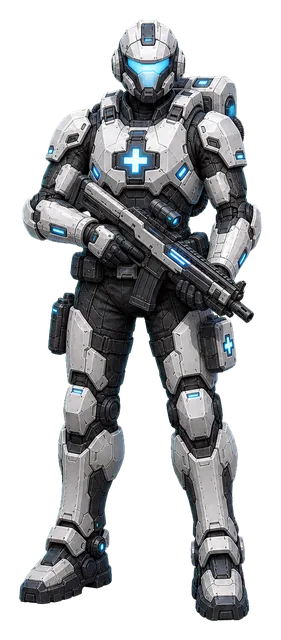                                    | [[Scourge-Survivors]] player | Review | No      | `packages/assets/games/scourge-survivors/players/pyre/patch/{front,side,back}.webp`   | Regenerate in locked 110px-ish pixel pipeline.                  |
| [[Field-Engineer]]         | 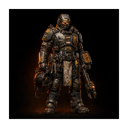                 | [[Deadlane]] Warden          | Review | No      | `packages/assets/entities/warden-field-engineer/deadlane.webp`                        | Replace catalog plate with final Deadlane camera render.        |
| [[Lane-Gunner]]            | 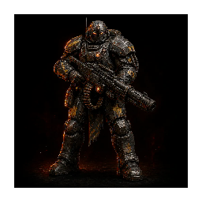                       | [[Deadlane]] Warden          | Review | No      | `packages/assets/entities/warden-lane-gunner/deadlane.webp`                           | Replace catalog plate with final Deadlane camera render.        |
| [[Wallwright]]             | 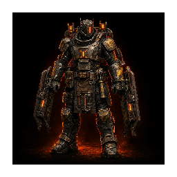                         | [[Deadlane]] Warden          | Review | No      | `packages/assets/entities/warden-wallwright/deadlane.webp`                            | Replace catalog plate with final Deadlane camera render.        |
| [[Pyre-Duelist]]           | 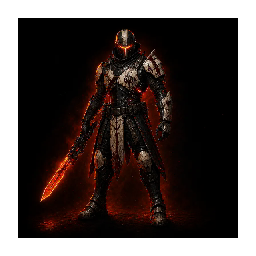                     | [[Pactfall]] Pyre            | Review | No      | `packages/assets/entities/pyre-duelist/pactfall.webp`                                 | Replace catalog plate with final Pactfall arena render.         |
| [[Pyre-Cauterizer]]        | 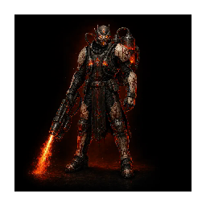               | [[Pactfall]] Pyre            | Review | No      | `packages/assets/entities/pyre-cauterizer/pactfall.webp`                              | Replace catalog plate with final Pactfall arena render.         |
| [[Warden-Bastion]]         | 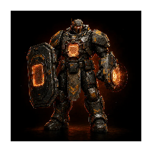                 | [[Pactfall]] Warden          | Review | No      | `packages/assets/entities/warden-bastion/pactfall.webp`                               | Replace catalog plate with final Pactfall arena render.         |
| [[Warden-Artillerist]]     | 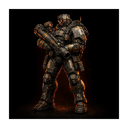         | [[Pactfall]] Warden          | Review | No      | `packages/assets/entities/warden-artillerist/pactfall.webp`                           | Replace catalog plate with final Pactfall arena render.         |
| [[Pyre-Interceptor-Pilot]] | 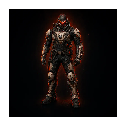 | [[Starblight]] Pyre pilot    | Review | No      | `packages/assets/entities/pyre-interceptor-pilot/starblight.webp`                     | Decide whether this is pilot portrait, cockpit sprite, or both. |
| [[Warden-Defense-Pilot]]   | 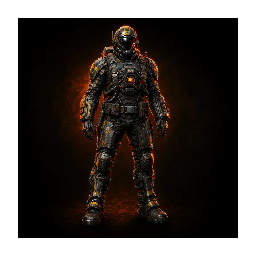     | [[Starblight]] Warden pilot  | Review | No      | `packages/assets/entities/warden-defense-pilot/starblight.webp`                       | Decide whether this is pilot portrait, cockpit sprite, or both. |
| [[Pyre-Courier]]           | 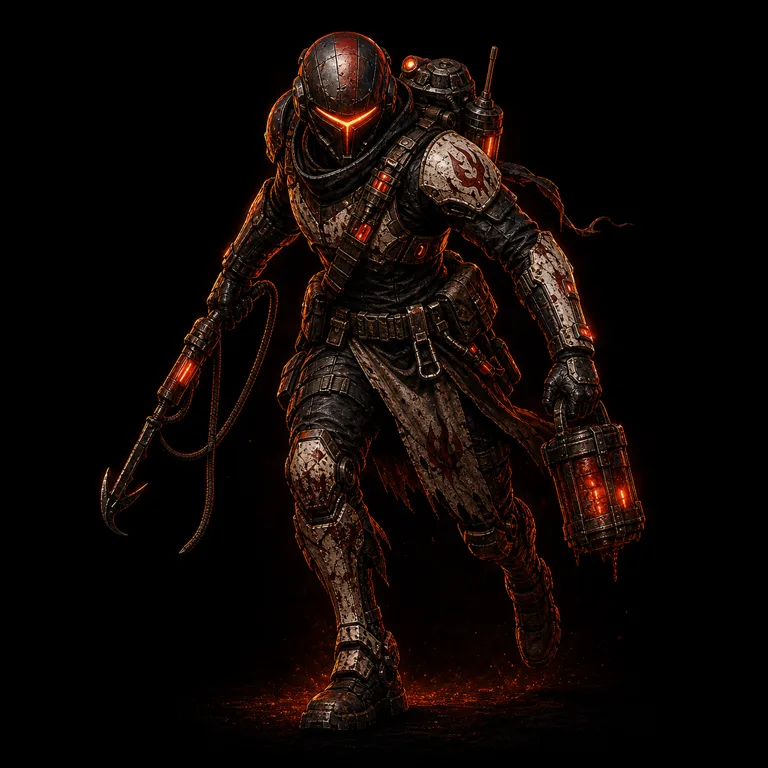                            | [[Redline]] Pyre courier     | Review | No      | `packages/assets/sites/deadrotcom/public/sprites/portrait-pyre-courier.webp`          | Add shared catalog/runtime render.                              |
| [[Warden-Courier]]         | 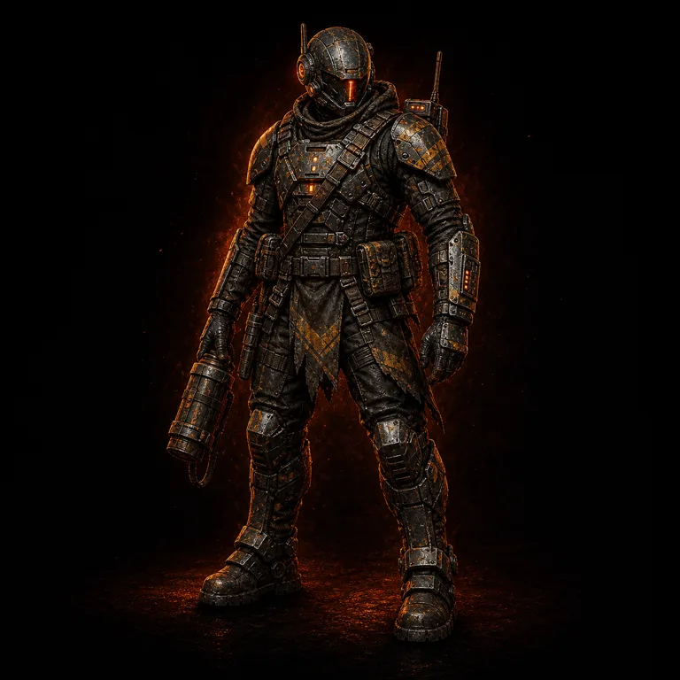                        | [[Redline]] Warden courier   | Review | No      | `packages/assets/sites/deadrotcom/public/sprites/portrait-warden-courier.webp`        | Add shared catalog/runtime render.                              |
| [[Pyre-Saboteur]]          | 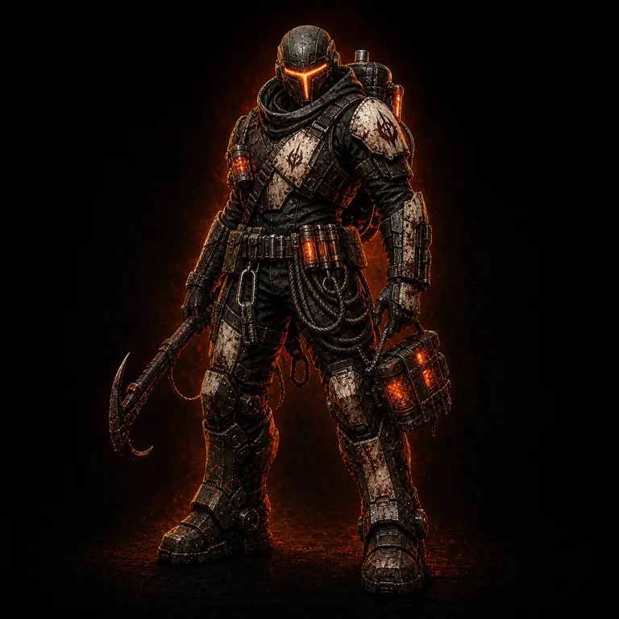                          | [[Rothulk]] Pyre infiltrator | Review | No      | `packages/assets/sites/deadrotcom/public/sprites/portrait-pyre-saboteur.webp`         | Add shared catalog/runtime render.                              |

## Enemy And Boss Locks

| Lore note                        | Preview                                                                                                                                 | Game/use                           | Good?  | Locked? | Current package source                                                                        | Next action                                                               |
| -------------------------------- | --------------------------------------------------------------------------------------------------------------------------------------- | ---------------------------------- | ------ | ------- | --------------------------------------------------------------------------------------------- | ------------------------------------------------------------------------- |
| [[Swarm-Ripper]] / Host Grunt    | 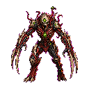    | [[Scourge-Survivors]] melee enemy  | Good   | Yes     | `packages/assets/games/scourge-survivors/enemies/scourge/host-grunt/{front,side,back}.webp`   | Wire animation frames into renderer.                                      |
| [[Swarm-Spitter]] / Spitter Host |                | [[Scourge-Survivors]] ranged enemy | Review | No      | `packages/assets/games/scourge-survivors/enemies/scourge/spitter-host/{front,side,back}.webp` | Review against locked reference, then promote/lock or regenerate.         |
| Winged Host                      | 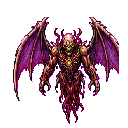                        | [[Scourge-Survivors]] flying enemy | Review | No      | `packages/assets/games/scourge-survivors/enemies/scourge/winged-host/{front,side,back}.webp`  | Add lore note or map to an existing host family entry; review style lock. |
| [[Breach-Boss]]                  |                  | [[Scourge-Survivors]] boss         | Good   | Yes     | `packages/assets/games/scourge-survivors/enemies/scourge/breach-boss/{front,side,back}.webp`  | Wire animation frames into renderer.                                      |
| [[Render]]                       | 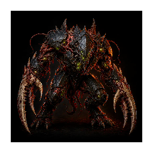                                 | Shared Scourge elite               | Review | No      | `packages/assets/entities/scourge-elite/deadlane.webp`                                        | Generate final per-game variants.                                         |
| [[Rot-Engine]]                   | 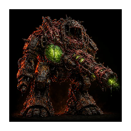                         | [[Deadlane]] Scourge elite         | Review | No      | `packages/assets/entities/rot-engine/deadlane.webp`                                           | Generate final Deadlane camera render.                                    |
| [[Graft-Breacher]]               | 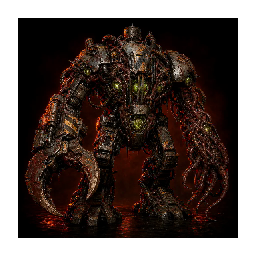                 | Shared Scourge enemy               | Review | No      | `packages/assets/entities/graft-breacher/deadlane.webp`                                       | Generate final per-game variants.                                         |
| [[Scourge-Fighter]]              |                | [[Starblight]] enemy craft         | Review | No      | `packages/assets/entities/scourge-fighter/starblight.webp`                                    | Replace with final Starblight sprite/ship render.                         |
| [[Orbital-Breach-Carrier]]       | 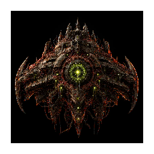 | [[Starblight]] boss craft          | Review | No      | `packages/assets/entities/orbital-breach-carrier/starblight.webp`                             | Replace with final Starblight boss render.                                |
| [[Trucebreaker]]                 | 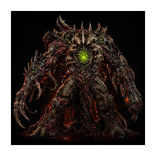                     | [[Pactfall]] neutral boss          | Review | No      | `packages/assets/entities/trucebreaker/pactfall.webp`                                         | Replace with final Pactfall boss render.                                  |

## Gaps

- No character row is locked yet. The Scourge melee host and breach boss are the only promoted locked runtime character/boss assets in this audit pass.
- Redline and Rothulk characters currently have portrait plates only, not shared catalog or runtime sprites.
- The current catalog preview plates unblock visibility, but they are not final camera-specific renders unless marked locked above.
- When assetgen promotes a new render, refresh the preview copy here and update `Good?`, `Locked?`, and source path in the matching row.
