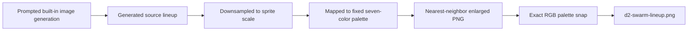
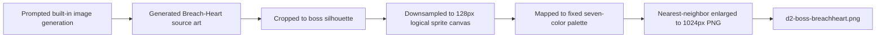

# Session 1: Swarm-Ripper Fine Sprite

## Affected Components
- Generated art asset: `d2-ripper-fine.png`
- Local session documentation: `.agent/SESSIONS/2026-06-04.md`

## What Was Done
- Generated a Swarm-Ripper source sprite with the built-in image generation tool.
- Post-processed the source into a crisp pixel-art PNG with nearest-neighbor scaling.
- Enforced the fixed seven-color canon palette:
  `#0a0a0a`, `#c1121f`, `#ff6a00`, `#7a3f1e`, `#e9e3d6`, `#4a5559`, `#8bdc1f`.
- Saved the final file to `d2-ripper-fine.png`.

## Key Decisions
- Used a 176px logical sprite canvas scaled 7x to preserve visible chunky pixels while keeping the sprite near the requested 160px-tall gameplay scale.
- Kept the near-black background opaque and clean instead of transparent, matching the prompt and existing bakeoff assets.
- Restricted toxic green usage to green-dominant source pixels so it remains confined to the Scourge core.

## Files Changed
- `d2-ripper-fine.png`
- `.agent/SESSIONS/2026-06-04.md`
- `.agent/SESSIONS/README.md`
- `.agent/SYSTEM/SUMMARY.md`

## Mistakes And Fixes
- Initial `ffmpeg` palette conversion introduced off-palette colors; replaced it with a stricter Pillow-based conversion.
- First strict palette pass lost too much red flesh detail; adjusted quantization to preserve blood red and rust separation.
- Removed stray black pixels from unused palette entries by filling all unused palette slots with near-black.

## Next Steps
- Compare `d2-ripper-fine.png` against `d2-ripper-medium.png` in the style bakeoff set.

# Session 2: D2 Scourge Swarm Lineup

## System Flow Diagram

## Affected Components
- Generated art asset: `d2-swarm-lineup.png`
- Local session documentation: `.agent/SESSIONS/2026-06-04.md`
- Session index: `.agent/SESSIONS/README.md`
- System summary: `.agent/SYSTEM/SUMMARY.md`

## What Was Done
- Generated one horizontal lineup of five Scourge rank-and-file enemies with the built-in image generation tool.
- Preserved the lineup as a single PNG on a near-black background.
- Post-processed the generated image into blocky pixel art by downsampling to sprite scale and enlarging with nearest-neighbor scaling.
- Enforced the fixed palette exactly:
  `#0a0a0a`, `#373d3f`, `#c1121f`, `#ff6a00`, `#763b1c`, `#e9e3d6`, `#8bdc1f`.
- Saved the final file to `d2-swarm-lineup.png`.

## Key Decisions
- Kept the generated five-enemy lineup because the silhouettes were distinct and readable: ripper, tall husk, spitter, armored scavenger, and tendril husk.
- Used a 4x nearest-neighbor enlargement from a 543x181 logical sprite sheet to create visible chunky pixels while preserving the original wide composition.
- Chose exact RGB values for the named gunmetal and rust palette slots because the prompt supplied exact hex values only for blood red, hellfire orange, bone, near-black, and toxic green.

## Files Changed
- `d2-swarm-lineup.png`
- `.agent/SESSIONS/2026-06-04.md`
- `.agent/SESSIONS/README.md`
- `.agent/SYSTEM/SUMMARY.md`

## Mistakes And Fixes
- The first local palette conversion attempt failed because `python` was not available and Pillow was not installed for `python3`.
- The first `ffmpeg` palette attempt expanded the colors into an internal palette; forced RGB output and then snapped every pixel to the exact seven requested RGB values with a small PNG reader/writer.
- The first palette pass left too much texture in the dark canvas; added a dark-pixel crush before final color mapping.

## Next Steps
- Compare `d2-swarm-lineup.png` against the other D2 bakeoff assets for faction consistency and gameplay readability at in-game scale.

# Session 3: D2 Breach-Heart Boss Sprite

## System Flow Diagram

## Affected Components
- Generated art asset: `d2-boss-breachheart.png`
- Local session documentation: `.agent/SESSIONS/2026-06-04.md`
- Session index: `.agent/SESSIONS/README.md`
- System summary: `.agent/SYSTEM/SUMMARY.md`

## What Was Done
- Generated a centered Breach-Heart boss source image with the built-in image generation tool.
- Post-processed it into a chunky 1024x1024 RGB sprite on a near-black background.
- Enforced the fixed seven-color canon palette exactly:
  `#0a0a0a`, `#373d3f`, `#7a3f1e`, `#c1121f`, `#ff6a00`, `#e9e3d6`, `#8bdc1f`.
- Saved the final file to `d2-boss-breachheart.png`.

## Key Decisions
- Used a 128x128 logical canvas scaled 8x, with the boss occupying 102x88 logical pixels, to preserve the requested bold 80px-class sprite grid while keeping boss scale.
- Retuned the palette mapping after the first pass was too rust-heavy, preserving more gunmetal chitin and blood-red host flesh.
- Kept toxic green restricted to obvious Scourge breach-core and bio-glow pixels.

## Files Changed
- `d2-boss-breachheart.png`
- `.agent/SESSIONS/2026-06-04.md`
- `.agent/SESSIONS/README.md`
- `.agent/SYSTEM/SUMMARY.md`

## Mistakes And Fixes
- First strict palette pass produced a valid seven-color PNG but visually overemphasized rust brown.
- Adjusted classification thresholds to preserve gunmetal, bone, and blood-red structure while keeping exact palette compliance.

## Next Steps
- Compare `d2-boss-breachheart.png` against `d2-breacher-elite.png` and `d2-ripper-bold.png` for gameplay-scale readability.
