# Scourge Foe Art Masters

This is the lore-app attachment point for Scourge foe art masters. Game runtime
sprites are derivatives; they do not define canon.

## Status

| Foe | Status | Lore Attachment | Design Lock |
| --- | --- | --- | --- |
| [[Swarm-Ripper]] | Candidate master attached | `Assets/Art-Masters/Scourge/swarm-ripper/swarm-ripper-master-fast-candidate.png` | [[Swarm-Ripper-DESIGN]] |
| [[Swarm-Spitter]] | Runtime visual lock attached; runtime-derived high-res candidate needs cleanup | `Assets/Art-Masters/Scourge/swarm-spitter/swarm-spitter-runtime-visual-lock.png` | [[Swarm-Spitter-DESIGN]] |
| [[Breach-Boss]] | Candidate breach-engine master attached | `Assets/Art-Masters/Scourge/breach-boss/breach-boss-breach-engine-master-turnaround.png` | [[Breach-Boss-DESIGN]] |
| [[Graft-Breacher]] | Candidate master attached | `Assets/Art-Masters/Scourge/graft-breacher/graft-breacher-master-turnaround.png` | [[Graft-Breacher-DESIGN]] |
| [[Orbital-Breach-Carrier]] | Candidate master attached | `Assets/Art-Masters/Scourge/orbital-breach-carrier/orbital-breach-carrier-master-turnaround.png` | [[Orbital-Breach-Carrier-DESIGN]] |
| [[Scourge-Fighter]] | Candidate master attached | `Assets/Art-Masters/Scourge/scourge-fighter/scourge-fighter-master-turnaround.png` | [[Scourge-Fighter-DESIGN]] |

## Swarm Ripper

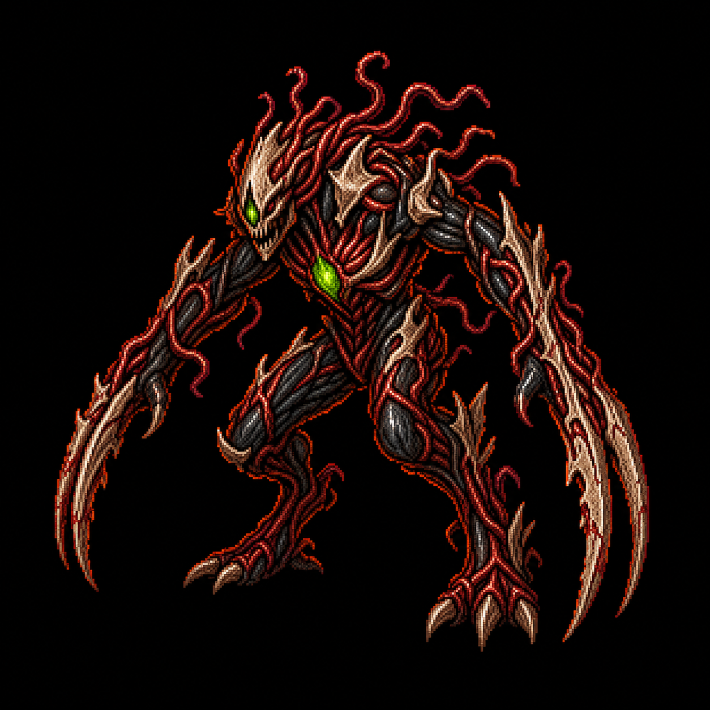

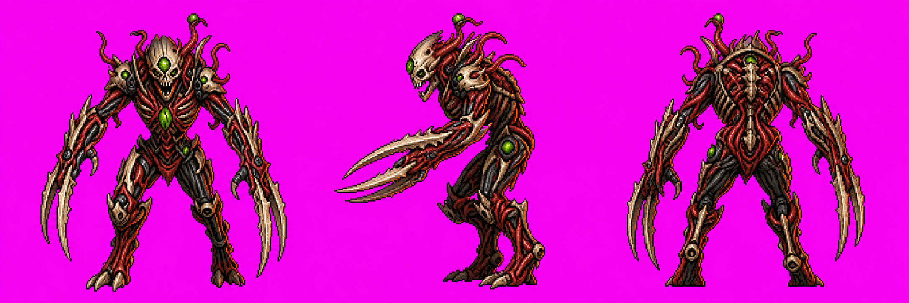

The fast candidate is the current best match for canon: it reads as quick melee
fodder with blade forearms and toxic-green breach nodes. The heavier candidate
is kept as reference only because it pushes too far toward elite/boss mass.

## Placeholder Attachments

These remain attached so the lore app can show what existed before this master
pass, but they do not define canon.

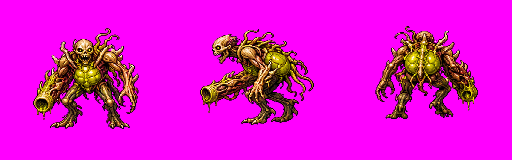

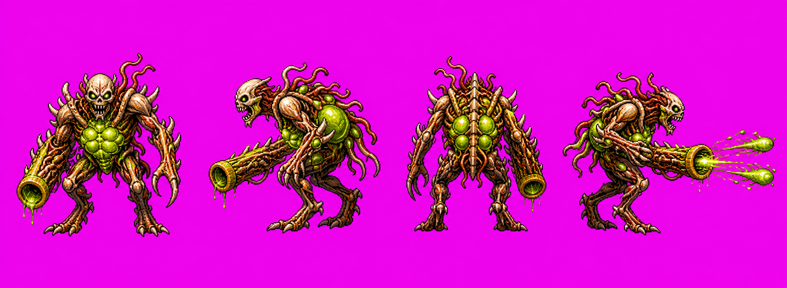

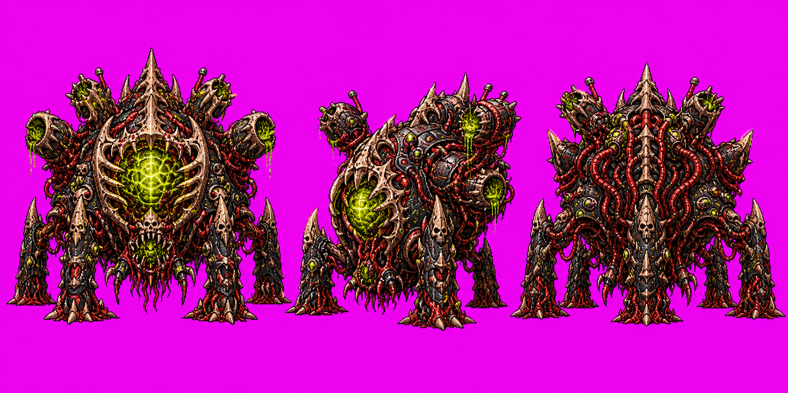

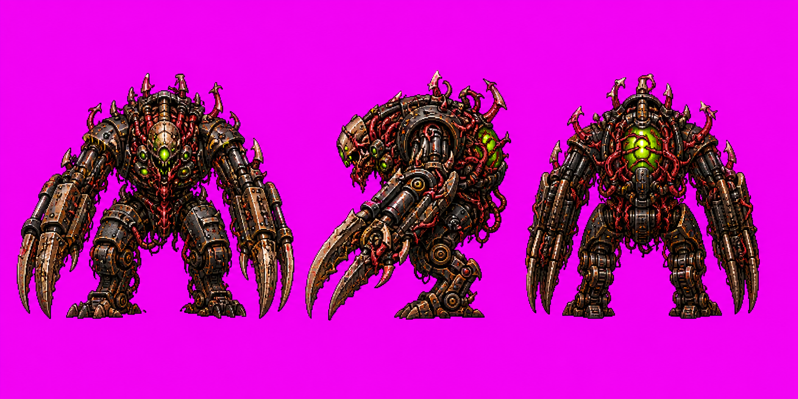

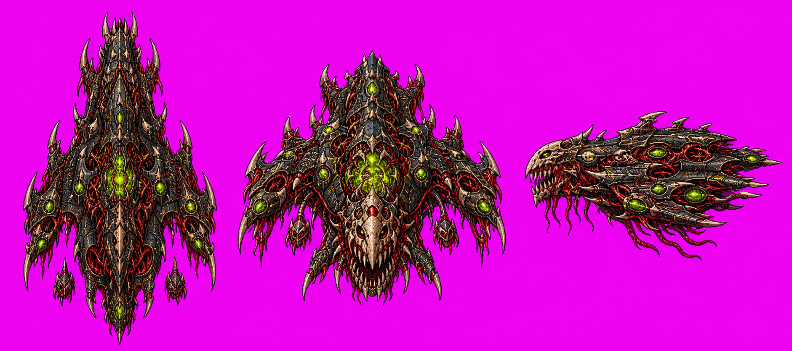

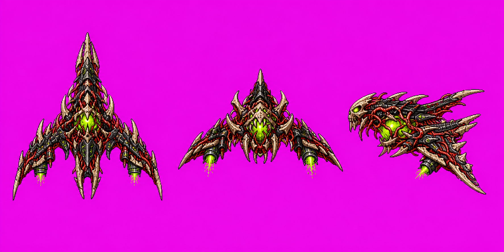

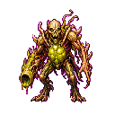

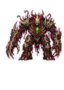

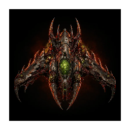

## Next Generation Pass

- Review the candidate masters in-lore, approve or request targeted variants,
  then split/pixel-clean runtime derivatives from approved sheets only.
- Regenerate game sprites from approved masters only.
