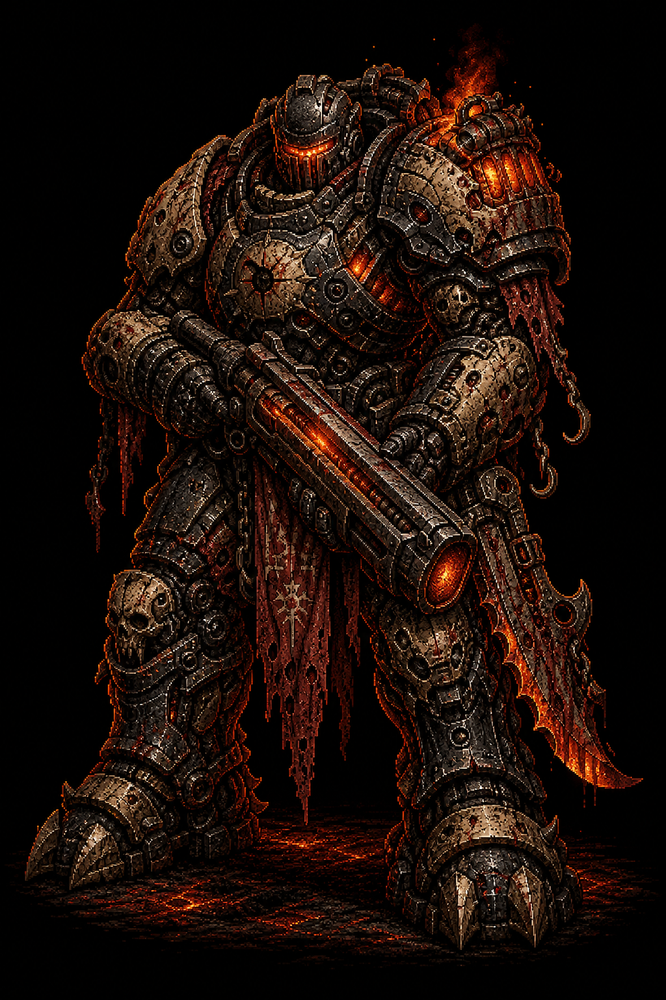
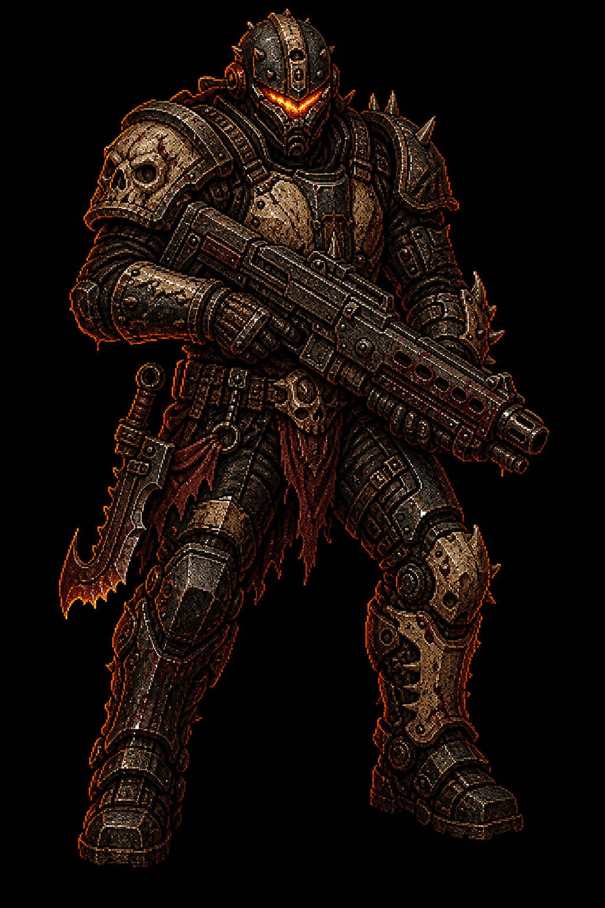
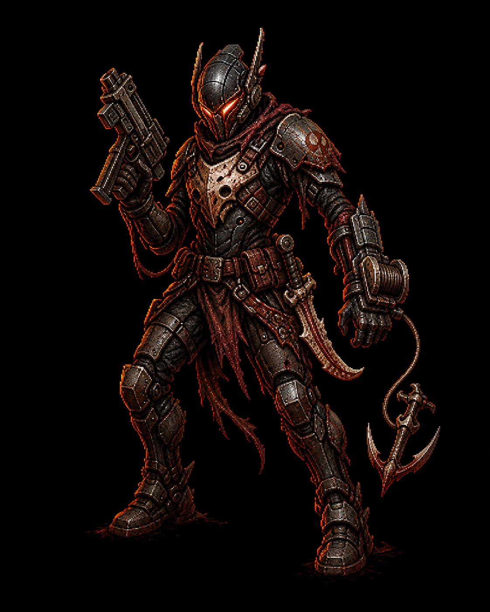
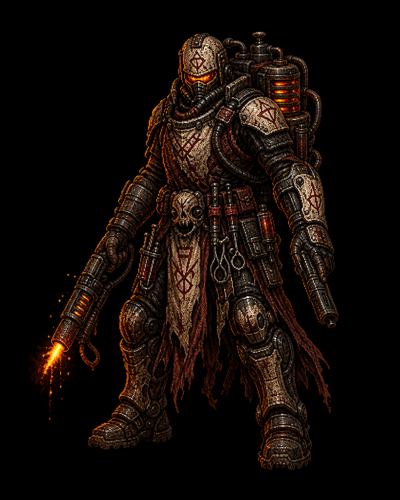
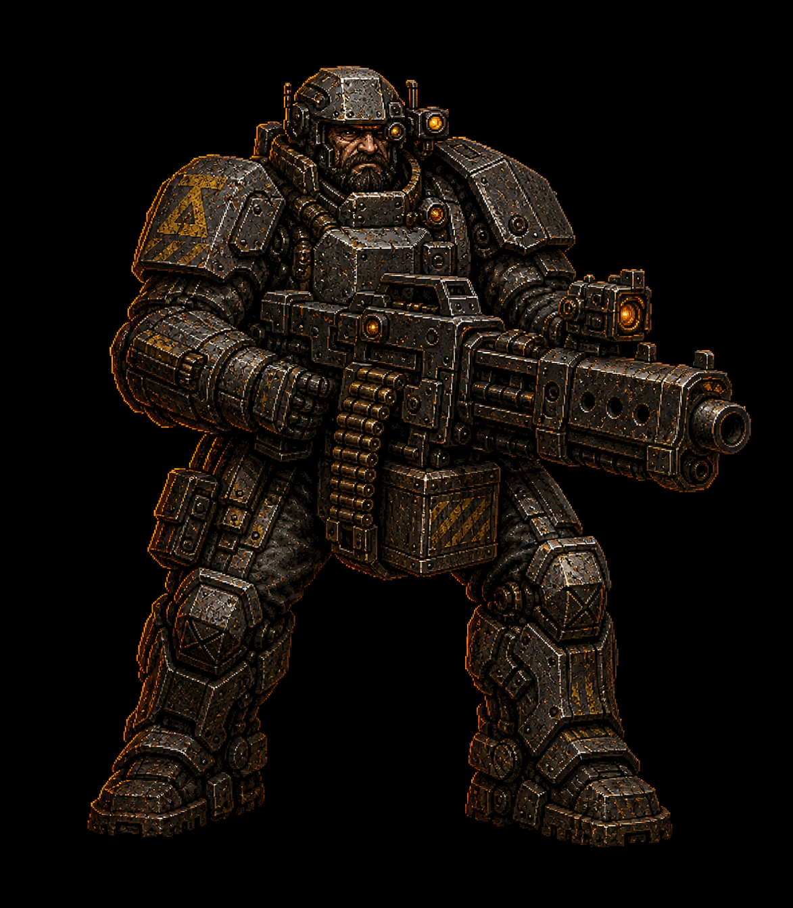
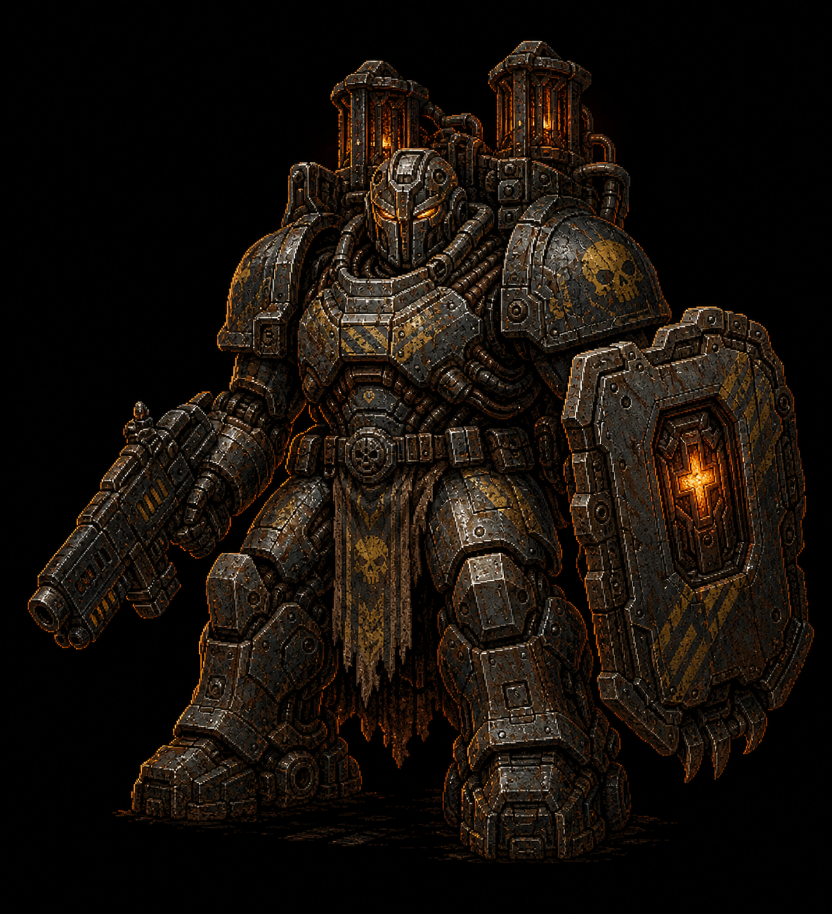

# Deadrot Character Master Candidates v01

Date: 2026-06-16

Status: first dedicated character master candidates for visual review. These are
not runtime sprites and should not be wired into game manifests until approved,
split into game-specific views, cleaned, converted to WebP, and validated
through the runtime asset pipeline.

Raw generation custody:
`packages/assets/_archive/raw-generator-cache/codex-generated-images/2026-06-16/raw/019ed273-1c2a-7320-9b42-92655439fad6/`

Generated source history:
`packages/assets/sources/generated/2026-06-16/lore/characters/master-candidates/`

## Direction

Human operators use **Berserk x DOOM x Gears of War x God of War** as a taste
stack: brutal mass, furnace gore, weathered infantry armor, mythic silhouette,
and practical kill-gear. This is not a license to copy named characters,
costumes, or clean white sci-fi armor.

## Candidates

## Notes

- Bulwark is the priority candidate: strong Pyre furnace-heavy read and a clear
  replacement direction for the clean package preview.
- Ranger and Vector establish the medium / fast Pyre range around Bulwark.
- Patch is useful as burn-medic direction, but should lose some ritual-cloth
  noise in runtime cleanup.
- Lane Gunner and Warden Bastion establish Warden square/industrial contrast.
