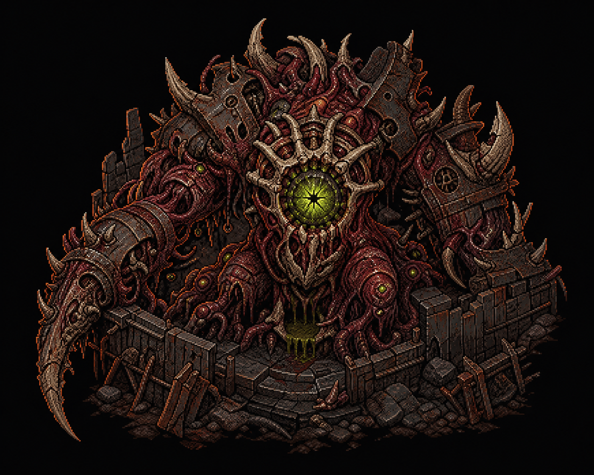
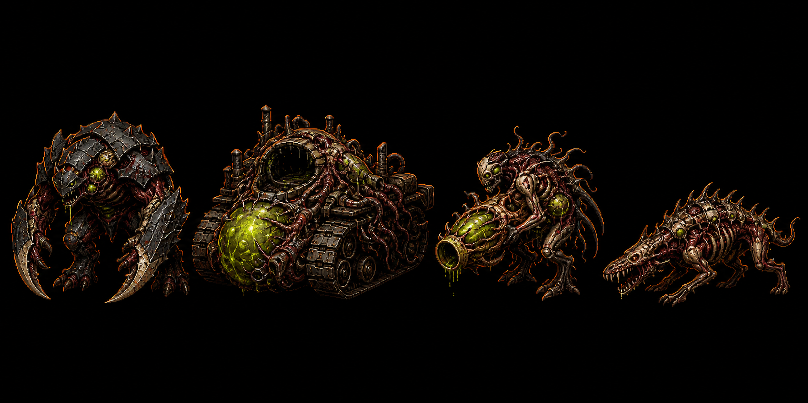
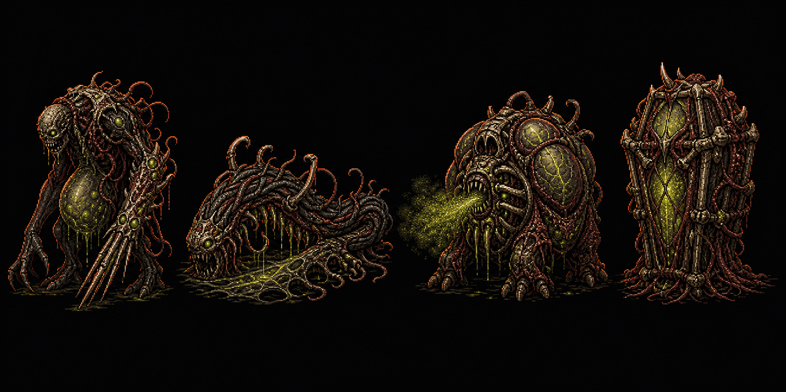
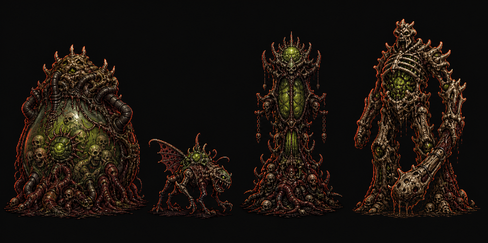
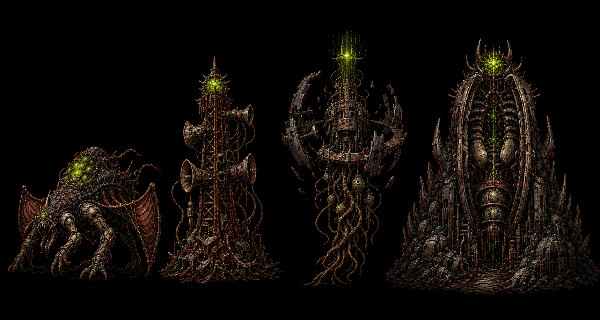
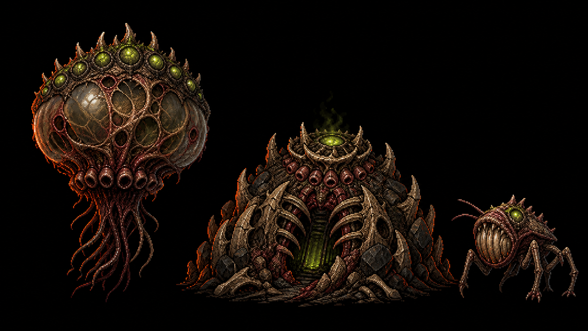

# Scourge Bestiary Master Candidates v01

Date: 2026-06-16

Status: first-pass master candidates for visual review. These are not runtime
sprites and should not be wired into game manifests until split, cleaned,
approved, and converted through the runtime asset pipeline.

Raw generation custody:
`packages/assets/_archive/raw-generator-cache/codex-generated-images/2026-06-16/raw/019ed273-1c2a-7320-9b42-92655439fad6/`

Generated source history:
`packages/assets/sources/generated/2026-06-16/lore/bestiary/master-candidates/`

## Candidates

### Trucebreaker

- Intended foe: `trucebreaker`
- Role read: Pactfall neutral objective boss.
- Keep: arena wreckage fused into the body, central toxic-green breach organ,
  broad top-down objective silhouette.
- Next pass: generate a strict top-down/three-quarter turnaround and minimap
  icon silhouette.

### Package-Critical Board

Left to right:

- `render` / `scourge-elite` - low armored charger.
- `rot-engine` - low machine-graft siege chassis.
- `swarm-spitter` - cleaned ranged host direction.
- `wound-hound` - low quadruped pack hunter.

Notes: Rot-Engine is the strongest read on this board. Swarm Spitter is closer
than the current blue package preview, but still needs a stricter front/side/back
turnaround before replacing catalog variants.

### Harvest And Spore Board

Left to right:

- `sower` - wrong-human harvester with seed-quill and brood-sac.
- `braid-worm` - ground-crawling carrier-weaver.
- `spore-lung` - respiratory spore hazard.
- `spore-casket` - coffin-like incubator pod.

Notes: Sower and Spore-Casket have strong silhouettes. Braid-Worm needs a lower,
more cable/bridge-tissue pass.

### Objective Heavy Board

Left to right:

- `gristle-vat` - rooted digestion/resource organ.
- `quaver` - small signal/scout candidate.
- `chorister` - rooted organic Choir repeater mast.
- `cairn` - bone titan walking wall.

Notes: Gristle-Vat, Chorister, and Cairn are usable directions. Quaver drifted
toward a winged imp and needs a smaller, twitchier signal-unit pass.

### Choir Relay Board

Left to right:

- `cantor` - mobile Choir repeater candidate.
- `carillon` - infrastructure pylon relay.
- `descant` - orbital/high-station relay.
- `bourdon` - subterranean rooted relay.

Notes: Carillon, Descant, and Bourdon establish useful infrastructure scales.
Cantor needs a lower, faster, back-node silhouette pass.

### Airborne And Alternate Relay Board

Left to right:

- `aeolian` - drifting atmospheric relay.
- `bourdon` alternate - lower subterranean gate objective.
- `quaver` alternate - small fragile signal unit.

Notes: Aeolian is a strong first read. The Bourdon alternate may be better for
gameplay than the taller relay-board version. Quaver alternate is closer to the
intended fragile role than the objective-heavy board candidate.

## Next Review Order

1. Approve or redirect Trucebreaker.
2. Split dedicated per-foe master prompts for `render`, `rot-engine`,
   `swarm-spitter`, and `wound-hound`.
3. Regenerate weak reads: `quaver`, `cantor`, and `braid-worm`.
4. Promote approved candidates into per-foe master folders with front/side/back
   pose locks before any runtime package replacement.
