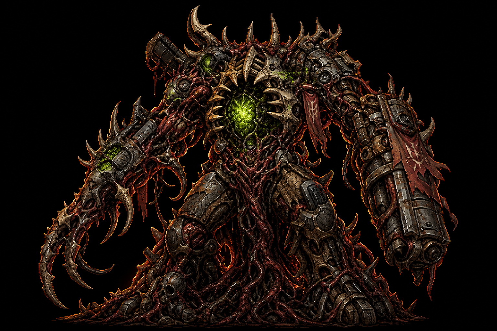
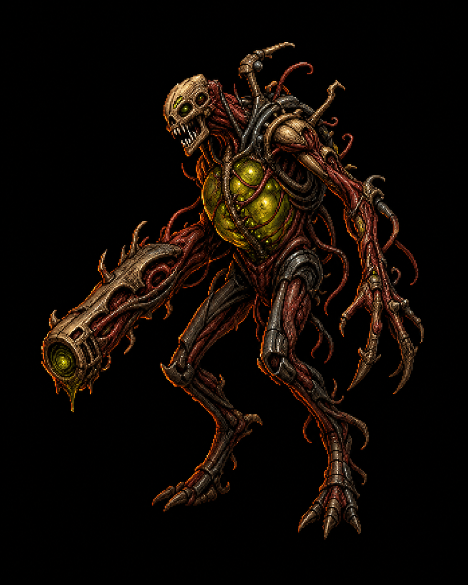
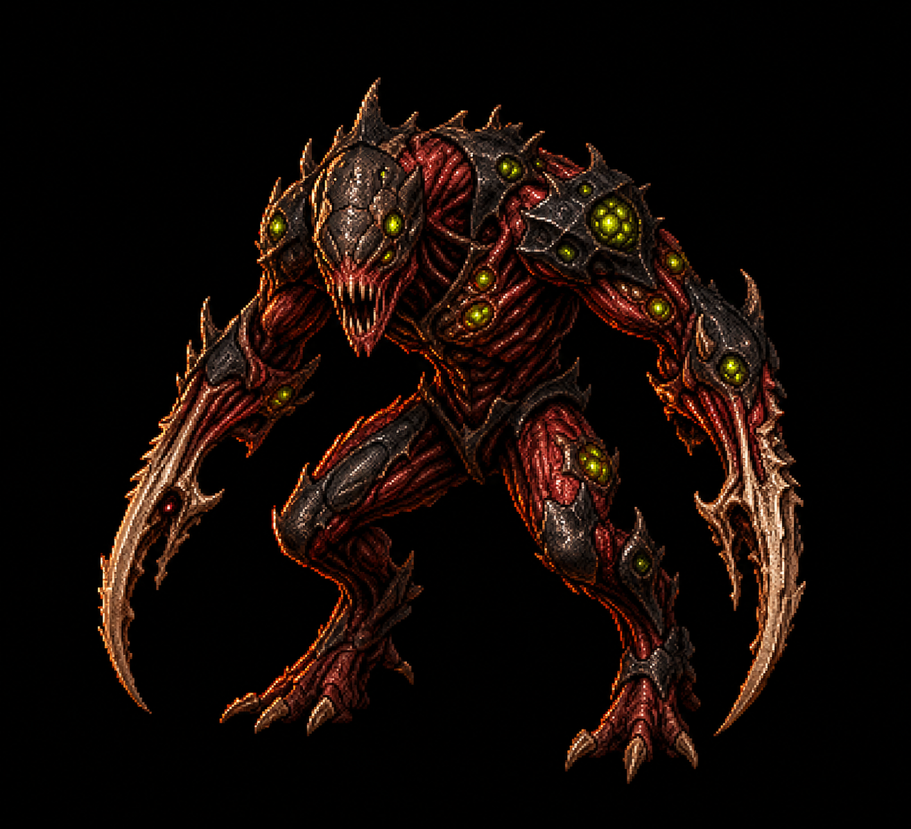
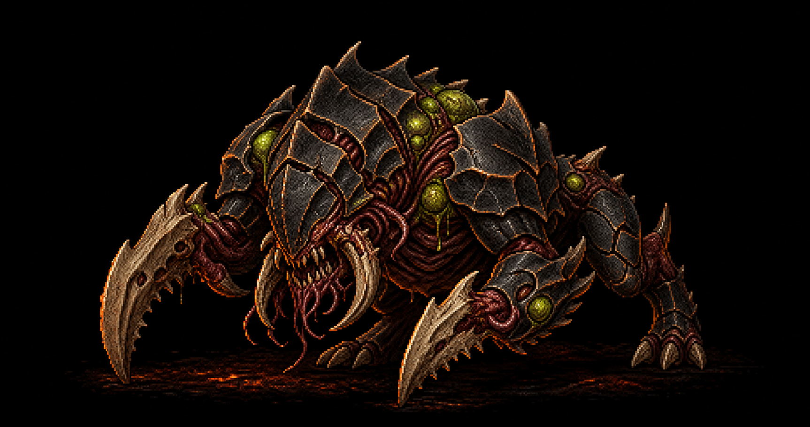
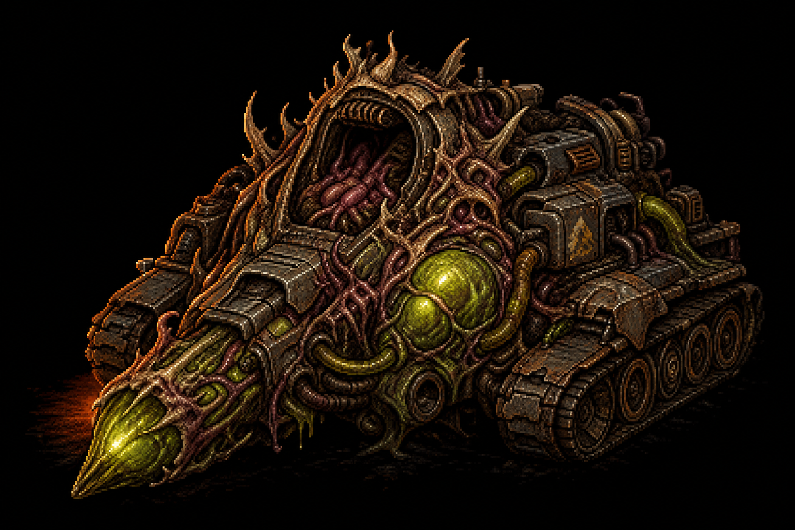
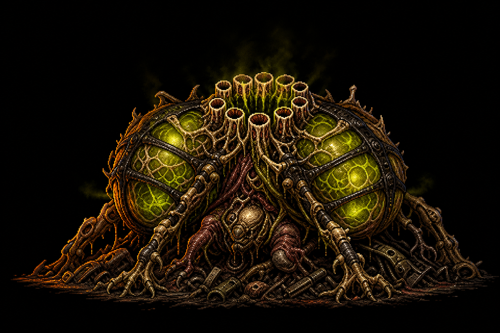

# Scourge Bestiary Master Candidates v02

Date: 2026-06-16

Status: dedicated per-foe master candidates for in-lore review. These are not
runtime sprites and should not be wired into game manifests until approved,
split into game-specific views, cleaned, converted to WebP, and validated
through the runtime asset pipeline.

Raw generation custody:
`packages/assets/_archive/raw-generator-cache/codex-generated-images/2026-06-16/raw/019ed273-1c2a-7320-9b42-92655439fad6/`

Generated source history:
`packages/assets/sources/generated/2026-06-16/lore/bestiary/master-candidates/`

## Candidates

### Trucebreaker

- Role read: Pactfall neutral objective boss / truce-forcing center threat.
- Keep: massive objective silhouette, central toxic breach core, bone/chitin
  fortress shell, arena wreckage fused into the body.
- Watch: still needs strict MOBA angle, minimap icon silhouette, and runtime
  scale pass.

### Swarm Spitter

- Role read: ranged acid unit.
- Keep: obvious projectile organ, thin backward-leaning body, acid-ochre /
  toxic sac lane, arm-lance silhouette.
- Watch: sac glow is intentionally strong; runtime cleanup should keep it as
  organ light, not body paint.

### Swarm Ripper

- Role read: fast melee fodder / swarm baseline.
- Keep: red-black body, bone blade forearms, small toxic nodes, no ranged sac.
- Watch: simplify detail for rank-and-file runtime sprites.

### Render

- Role read: low armored chitin charger.
- Keep: low/wide silhouette, shell plates, blade-claw forelimbs, heavy elite
  mass distinct from Swarm Ripper.
- Watch: needs enrage/open-seam variant before runtime promotion.

### Rot-Engine

- Role read: low machine-graft siege vehicle.
- Keep: tracked chassis, hollow cab, front bile sac as threat and weak point,
  rusted gunmetal / old hazard markings.
- Watch: green is strong; next pass should pull more hull mass into rust,
  verdigris, and gunmetal.

### Spore-Lung

- Role read: anchored double-lung area denial unit.
- Keep: twin sacs, intake crown, low body, root-hooks, fog hazard silhouette.
- Watch: runtime versions need bloom / collapsed death variants.

## Next Review Order

1. Approve or redirect the individual v02 candidates in lore.
2. Generate missing individual masters for `wound-hound`, `sower`,
   `spore-casket`, `braid-worm`, `gristle-vat`, `cairn`, and the Choir relay
   family.
3. Turn approved masters into game-specific front/side/back or camera-angle
   sheets only after visual lock.
